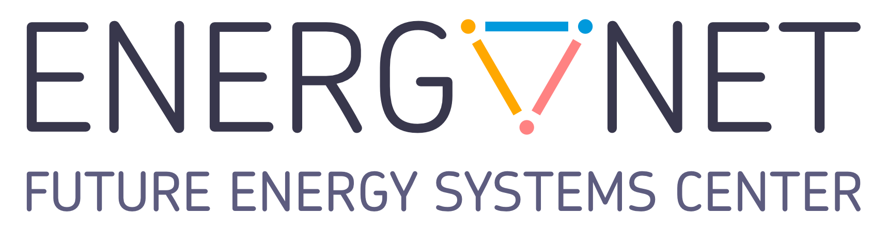

<picture>
  <source media="(prefers-color-scheme: dark)" srcset="assets/energynet-logo-en-dark.png">
  <source media="(prefers-color-scheme: light)" srcset="assets/energynet-logo-en-light.png">
  
</picture>

# EnergyNet Digest

Quarterly highlights from the NTI EnergyNet community

**[Read the latest issue — Q1 2026][digest-2026-q1]**

[English](#english) · [Русский](#русский) · [简体中文](#简体中文)

## English

The EnergyNet Digest follows the events, projects, research, and ideas shaping the development of intelligent and distributed energy systems. Each issue offers a concise view of the quarter and links the EnergyNet community’s work to the wider transformation of the energy sector.

The current issues are published in Russian.

### 2026

- [Q1 2026][digest-2026-q1]

### 2025

- [Q4 2025][digest-2025-q4]
- [Q3 2025][digest-2025-q3]
- [Q2 2025][digest-2025-q2]
- [Q1 2025][digest-2025-q1]

[Explore the EnergyNet analytical library](https://energynet.ru/library) · [Official website](https://ioen.ru)

## Русский

«Дайджест EnergyNet» рассказывает о событиях, проектах, исследованиях и идеях, которые формируют развитие интеллектуальной и распределённой энергетики. Каждый выпуск подводит краткие итоги квартала и показывает работу сообщества EnergyNet в контексте преобразований энергетической отрасли.

### 2026

- [I квартал 2026 года][digest-2026-q1]

### 2025

- [IV квартал 2025 года][digest-2025-q4]
- [III квартал 2025 года][digest-2025-q3]
- [II квартал 2025 года][digest-2025-q2]
- [I квартал 2025 года][digest-2025-q1]

[Все материалы аналитической библиотеки EnergyNet](https://energynet.ru/library) · [Официальный сайт](https://ioen.ru)

## 简体中文

《EnergyNet 简报》关注推动智能化、分布式能源系统发展的活动、项目、研究与理念。每期简要回顾一个季度的重点动态，并从能源行业转型的更广阔背景介绍 EnergyNet 社群的工作。

目前各期简报以俄文发布。

### 2026

- [2026 年第 1 季度][digest-2026-q1]

### 2025

- [2025 年第 4 季度][digest-2025-q4]
- [2025 年第 3 季度][digest-2025-q3]
- [2025 年第 2 季度][digest-2025-q2]
- [2025 年第 1 季度][digest-2025-q1]

[浏览 EnergyNet 分析资料库](https://energynet.ru/library) · [官方网站](https://ioen.ru)

[digest-2026-q1]: https://docs.yandex.ru/docs/view?name=%D0%94%D0%B0%D0%B9%D0%B4%D0%B6%D0%B5%D1%81%D1%82_I_%D0%BA%D0%B22026_%D0%B8%D1%82%D0%BE%D0%B3.pdf&nosw=1&url=ya-disk-public%3A%2F%2FhUfKfgL8kGGSH3OOOwAJOFlPSDv9fy%2FxgAMv5cf0%2F8RSlALj4K2Zwv%2FKcXSBPIijq%2FJ6bpmRyOJonT3VoXnDag%3D%3D
[digest-2025-q4]: https://docs.yandex.ru/docs/view?name=%D0%94%D0%B0%D0%B9%D0%B4%D0%B6%D0%B5%D1%81%D1%82+IV.pdf&nosw=1&url=ya-disk-public%3A%2F%2FuNzehphK0A9fBF274ZoXY%2F0DVqJm8sJI2Z3%2Fsf8009Yz5pQga4e7swCpgYb5leOMq%2FJ6bpmRyOJonT3VoXnDag%3D%3D
[digest-2025-q3]: https://docs.yandex.ru/docs/view?name=%D0%94%D0%B0%D0%B9%D0%B4%D0%B6%D0%B5%D1%81%D1%82+III+%D0%B8%D1%82%D0%BE%D0%B3.pdf&nosw=1&url=ya-disk-public%3A%2F%2Fgmq5XKWBdzAugP0W2EmJQXJqBpC1eUhhT9MnfRcZYB7mYFGmNdxZ6P1yb%2Fb6Xdqkq%2FJ6bpmRyOJonT3VoXnDag%3D%3D
[digest-2025-q2]: https://docs.yandex.ru/docs/view?url=ya-disk-public%3A%2F%2Fdt2PN%2FF3jaX52g1MQ5FWEm29t8DY1pj4XF5a%2Fe6u42mQQeDx581nKESGHJLfIrCEq%2FJ6bpmRyOJonT3VoXnDag%3D%3D&name=%D0%94%D0%B0%D0%B9%D0%B4%D0%B6%D0%B5%D1%81%D1%82%20II%2025.07.pdf&nosw=1
[digest-2025-q1]: https://docs.yandex.ru/docs/view?url=ya-disk-public%3A%2F%2FFtPRNlY%2F3xhHjlPitojr35a3yHc3BRB8pY%2BE8DdkrbhFFH0vsgr9dzsbuAeXdhp0q%2FJ6bpmRyOJonT3VoXnDag%3D%3D&name=%D0%94%D0%B0%D0%B9%D0%B4%D0%B6%D0%B5%D1%81%D1%82%2010.04.pdf&nosw=1
